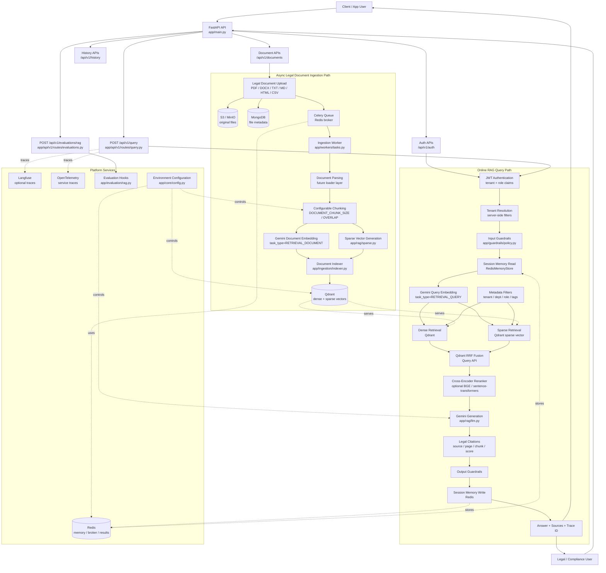

# End-to-End Legal Document Architecture

For the full system guide, see [end-to-end.md](/Users/dev/Documents/resume-projects/productionRAG/docs/end-to-end.md).

## Runtime Flow

1. The client sends a query to FastAPI.
2. Auth resolves user, tenant, and role context. In the current scaffold, auth exists under `/api/v1/auth`; production tenant claims should be injected server-side before retrieval.
3. The RAG pipeline validates the query, loads Redis conversation memory, embeds the query with Gemini using `RETRIEVAL_QUERY`, builds a lexical sparse query vector, and runs Qdrant hybrid retrieval.
4. Metadata filters enforce tenant, department, role, tag, and legal-domain boundaries during retrieval.
5. Results are merged with reciprocal rank fusion, optionally reranked with a cross-encoder, then passed to Gemini for grounded answer generation.
6. Legal citation metadata is returned from source chunks where available: document ID, source, page, chunk index, and confidence score.
7. The response is guardrail-checked, written back to Redis session memory, traced, and returned with source chunks and a trace ID.
8. Legal document ingestion runs asynchronously through Celery: uploaded or JSON-provided documents are parsed, chunked with configurable chunk settings, embedded with Gemini using `RETRIEVAL_DOCUMENT`, converted to sparse lexical vectors, then indexed into Qdrant.

## Configurable Legal Profile

The legal document profile is controlled through [app/core/config.py](/Users/dev/Documents/resume-projects/productionRAG/app/core/config.py) and [.env.example](/Users/dev/Documents/resume-projects/productionRAG/.env.example):

| Variable | Purpose |
| --- | --- |
| `PLATFORM_PROFILE` | Runtime profile, default `enterprise` |
| `DOCUMENT_DOMAIN` | Domain profile, default `legal` |
| `DOCUMENT_CHUNK_SIZE` | Legal document chunk size used by Celery ingestion |
| `DOCUMENT_CHUNK_OVERLAP` | Chunk overlap used to preserve clause continuity |
| `LEGAL_CITATIONS_REQUIRED` | Signals that answers should preserve source citation metadata |
| `LEGAL_REQUIRED_METADATA_FIELDS` | Comma-separated metadata fields expected for legal retrieval boundaries |
