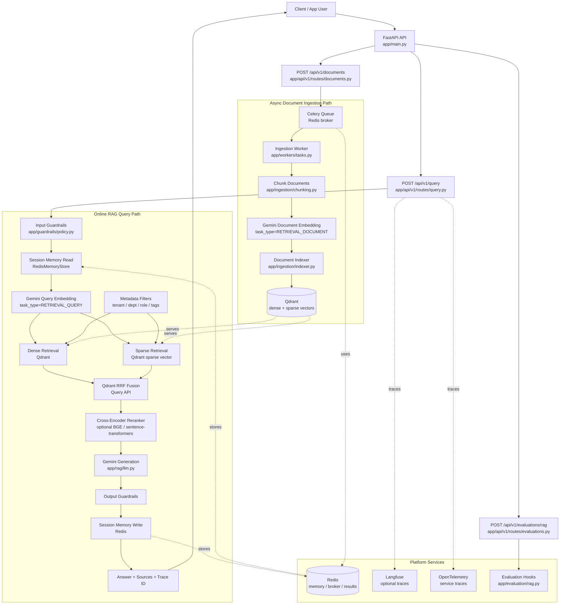

# End-to-End Architecture

For the full system guide, see [end-to-end.md](/Users/dev/Documents/resume-projects/productionRAG/docs/end-to-end.md).

## Runtime Flow

1. The client sends a query to FastAPI.
2. The RAG pipeline validates the query, loads Redis conversation memory, embeds the query with Gemini using `RETRIEVAL_QUERY`, builds a lexical sparse query vector, and runs Qdrant hybrid retrieval.
3. Metadata filters enforce tenant, department, role, and tag boundaries during retrieval.
4. Results are merged with reciprocal rank fusion, optionally reranked with a cross-encoder, then passed to Gemini for grounded answer generation.
5. The response is guardrail-checked, written back to Redis session memory, traced, and returned with source chunks.
6. Document ingestion runs asynchronously through Celery: documents are chunked, embedded with Gemini using `RETRIEVAL_DOCUMENT`, converted to sparse lexical vectors, then indexed into Qdrant.
